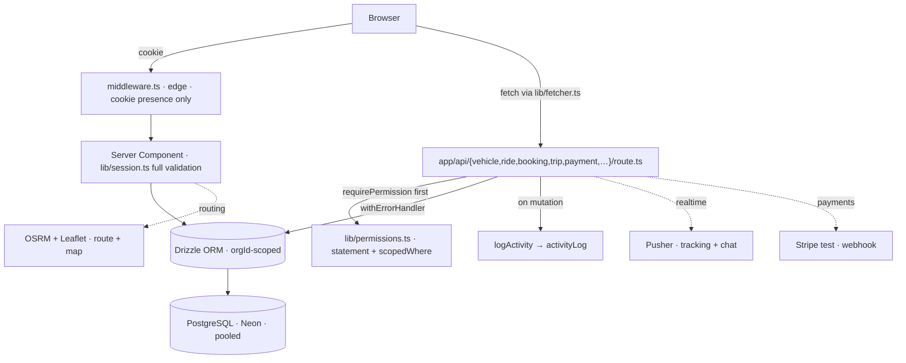

# Architecture

Next.js 15 (App Router) · React 18 · TypeScript (strict) · Tailwind v3 + shadcn/ui · Framer Motion ·
React Hook Form + Zod · TanStack Query · PostgreSQL (Neon) · Drizzle ORM · Auth.js (next-auth v5) +
custom RBAC · UploadThing · Resend + React Email · @react-pdf/renderer · pnpm · Vercel.

## High-level diagram



Every domain resource is `orgId`-scoped for non-super-admins: `requirePermission` returns
`{ session, tenant }`, inserts set `tenant.orgId`, and reads pass through `scopedWhere`. A cross-org
fetch by id returns **404, not 403**. `requireSuperAdmin()` is the one audited cross-tenant path.

## Request lifecycle

1. **`middleware.ts` (edge).** Cheapest possible gate: checks the session cookie is *present*.
   It does **not** decode or validate — the edge runtime is not the place for the DB or crypto.
   No cookie on a protected path → redirect to login.
2. **Server Component.** Real authorization happens here via `lib/session.ts`
   (`requireSession`, `requireRolePage`, `requirePermissionPage`, `getCurrentUser`). The page
   fetches its own data server-side and passes it down.
3. **API route** (`app/api/<resource>/…`). Client mutations and client-side reads (TanStack Query)
   hit these. Every handler is wrapped in `withErrorHandler` (`lib/api.ts`) and opens with
   `requirePermission` (`lib/permissions.ts`).
4. **Drizzle ORM** (`db/`). Typed queries against the schema in `db/schema/`.
5. **Neon (PostgreSQL).** Always the **pooled** host under serverless. See `docs/database.md`.
6. **Cross-cutting on success.** Mutations call `logActivity` (`lib/activity.ts`); other concerns
   route through their shared utility (below).

## RBAC flow

`lib/permissions.ts` is the single source of truth. Full detail in the `rbac-guard` skill.

```text
statement {resource → actions}         ← add a resource here
        │
        ▼
roles {role → subset of statement}     ← grant per role here (adding a role = new entry)
        │
        ▼
hasPermission(role, resource, action)  ← pure, client-safe
        │
        ├─ requirePermission(resource, action)  → API routes / server actions (throws 401/403)
        ├─ requirePermissionPage(...)            → server components (redirects)
        └─ canEdit / canDelete / canView / canApprove(role, ownerId, userId)  → ownership scope
```

- `roleHierarchy` is numeric (`super_admin:100, company_admin:50, employee:10`); `atLeast(role, min)`
  compares tiers.
- **Gate both layers.** UI hides (nav, buttons); API enforces. Hiding a nav item is not
  authorization.
- **Tenancy layers on top of RBAC.** After the permission check, every non-super-admin query is
  `orgId`-scoped via `scopedWhere(tenant, table, …)`. `requireSuperAdmin()` is the sole cross-tenant
  path; cross-org access returns **404, not 403**.

## Extensibility contract

The scaffold is built so the domain drops in **additively**. Five points:

1. **A new entity is purely additive.** It is four new paths and one config line — with **zero
   edits to existing feature code**:
   - `features/<entity>/` (copy `features/vehicle/`)
   - `db/schema/<entity>.ts` (+ one export line in `db/schema/index.ts`, integrator only)
   - `app/api/<entity>/` (copy the `vehicle` route shape)
   - one entry in `nav.config.ts` (integrator only)
2. **Sections are config-driven, not hand-laid.** `nav.config.ts`, `dashboard.config.ts`,
   `homepage.config.ts` are data arrays. Adding a nav item / dashboard widget / homepage section
   is a data change, never a layout rewrite.
3. **Roles extend via the `statement` object.** New resource/action pairs go in `statement`;
   per-role sets derive from it. Adding a role is one new entry in `roles`, never a new `if`.
4. **Cross-cutting concerns go through existing utilities — never reimplemented per feature:**
   notifications, activity log, uploads, PDF, email (see list below).
5. **The API shape is fixed** (see `docs/api.md`). Every resource has the same route layout, so a
   reviewer — or a teammate — can predict where any endpoint lives.

## Cross-cutting utilities

Route every cross-cutting concern through its one utility. Do not roll your own.

| Concern             | Utility / entry point                               | Table / target |
| ------------------- | --------------------------------------------------- | -------------- |
| Authorization       | `lib/permissions.ts`                                | —              |
| Server-side auth    | `lib/session.ts`                                    | —              |
| Error envelope      | `lib/api.ts` (`withErrorHandler`, `ok`, …)          | —              |
| Typed errors        | `lib/errors.ts`                                     | —              |
| Audit trail         | `lib/activity.ts` (`logActivity`)                   | `activityLog`  |
| Notifications       | `db/schema/notification.ts` + bell in shell         | `notification` |
| File uploads        | `app/api/uploadthing/core.ts`, `lib/uploadthing.ts` | (UploadThing)  |
| PDF generation      | `lib/pdf/render.ts` + a document component          | —              |
| Transactional email | `lib/email.ts` + `emails/` (React Email)            | —              |
| Client fetch        | `lib/fetcher.ts`                                    | —              |
| Env access          | `lib/env.ts`                                        | —              |
| Design tokens       | `lib/design-tokens.ts`                              | —              |

## Carpooling architecture notes

- **Multi-tenancy** is load-bearing (`docs/PRD.md` §5): `orgId` on every domain table, set once at
  join, enforced at the data layer via `scopedWhere` — not per-route. See `docs/decisions.md` ADR-009.
- **Realtime (Pusher)** carries both live tracking and per-trip chat on one channel keyed per trip;
  fallback is 4-second polling of `trip.driverLat/Lng`. See ADR-010.
- **Maps/routing** use OpenStreetMap + Leaflet (render) and OSRM (route/ETA). Route geometry is
  cached on the `ride` row to avoid re-hitting the OSRM demo server. See ADR-011.
- **Payments (Stripe test)** confirm via webhook at `/api/stripe/webhook`; the wallet is an
  append-only `walletEntry` ledger (balance = sum of deltas). See ADR-012.
- **Reports are computed**, never stored — a query over `trip`+`ride`+`vehicle`+`walletEntry`.

Any new domain-specific architectural choice is logged as an ADR in `docs/decisions.md`.
